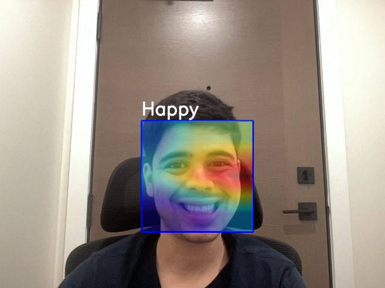

# Project Name : Facial emotion recognition
## Table Of Contents
- **[Description](#p1)**
- **[Usage](#p2)**
- **[Dataset](#p3)**
- **[Credits](#p4)**

 
# Description:

This project implements a deep learning model for facial emotion recognition. We developed a version of the VGG architecture and trained it on a dataset containing facial images with various expressions. The model is designed to classify these emotions accurately. Given the complexity of facial recognition, we incorporated an explainable AI technique, Grad-CAM, to generate heatmaps that highlight the specific regions of the image the model focuses on when making predictions. This allows for greater transparency and interpretability of the model's decision-making process.

 
# Usage:

Users can run this Jupyter notebook either on a cloud service like Google Colab or locally on their machine. The notebook is structured with separate cells to accommodate both environments, allowing for easy configuration depending on the preferred setup. Detailed instructions are provided within the notebook to guide users through the process of selecting the appropriate runtime environment.

 
# Dataset:

We have used the FER-2018 dataset, which is available [here](https://www.kaggle.com/datasets/ashishpatel26/fer2018/data). This dataset is derived from the work of Goodfellow et al. (2013), whose paper can be viewed at [link](https://arxiv.org/pdf/1307.0414).

 
# Credits
This work is inspired from [this](https://github.com/omarsayed7/Deep-Emotion) work, which gave us many insights and served as the foundation for further enhancing it with new features.
